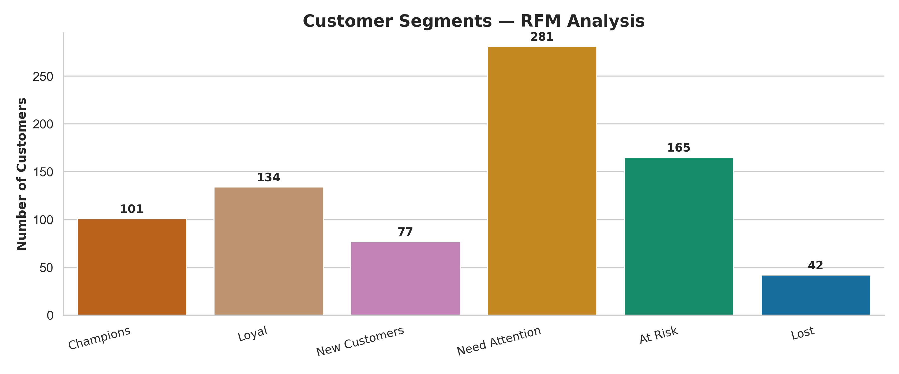

 

 
 
 
 

# 🧺 RFM Segmentation for Customer Analytics

This project demonstrates how to apply RFM (Recency, Frequency, Monetary) segmentation to e-commerce customer data to support personalized marketing strategies and improve customer retention.

---

## 🎯 Business Objective

- Identify high-value customers (VIPs)
- Detect churn risks early
- Improve marketing ROI through targeted segmentation

---

## 📊 What is RFM?

**RFM** is a simple, powerful technique to segment customers based on:
- **Recency**: How recently a customer made a purchase
- **Frequency**: How often they purchase
- **Monetary**: How much money they spend

Each customer receives a score from 1 (lowest) to 4 (highest) in each category. These scores are combined into an RFM Score (e.g., `444`, `231`).

---

## 🔧 Tools Used

- Python (pandas, matplotlib, seaborn)
- Jupyter Notebook
- Synthetic dataset (`transactions.csv`)

---

## 🧪 Methodology

1. Loaded synthetic transactional data
2. Calculated Recency (days since last purchase), Frequency (number of orders), and Monetary (total spend)
3. Assigned each customer into quartiles per R/F/M dimension
4. Built composite RFM scores and mapped to human-readable segments
5. Visualized customer distribution across segments

---

## 📈 Customer Segments

| Segment        | Description                              | Example Actions                     |
|----------------|------------------------------------------|-------------------------------------|
| **Champions**  | Recent, frequent, high spenders          | Early access to new products        |
| **Loyal**      | Frequent buyers, moderate spend          | Loyalty rewards program             |
| **New**        | Recent but low activity so far           | Onboarding offers, welcome email    |
| **At Risk**    | High past spenders, but gone quiet       | Win-back campaigns                  |
| **Lost**       | Inactive, low-spending customers         | Remove from paid ads, last promo    |
| **Need Attention** | Average or mixed score customers     | Personalized discounts              |

---

## 📂 Project Structure

.  
├── data/  
│ └── transactions.csv  
├── notebooks/  
│ └── rfm_analysis.ipynb  
├── requirements.txt  
└── README.md

---

## 🚀 How to Run

1. Clone this repository
2. Install dependencies: `pip install -r requirements.txt`
3. Open the notebook: `notebooks/rfm_analysis.ipynb`
4. Run the cells and explore customer segments

---

## 📬 Next Steps

- Connect to real customer data (SQL or API)
- Automate segmentation with Airflow or dbt
- Integrate with marketing platforms (Mailchimp, Meta Ads)
- Monitor segment shifts over time with dashboards

---

